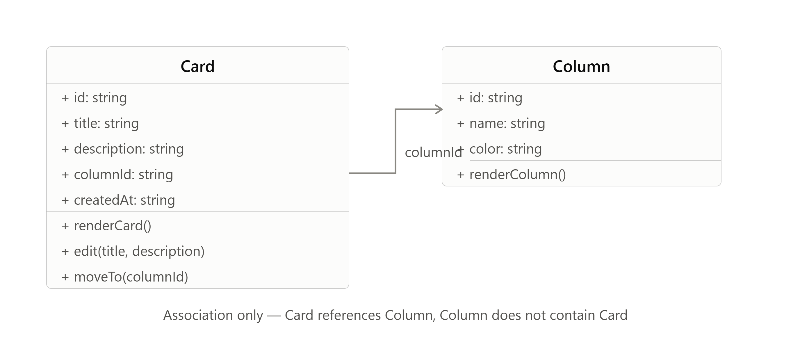
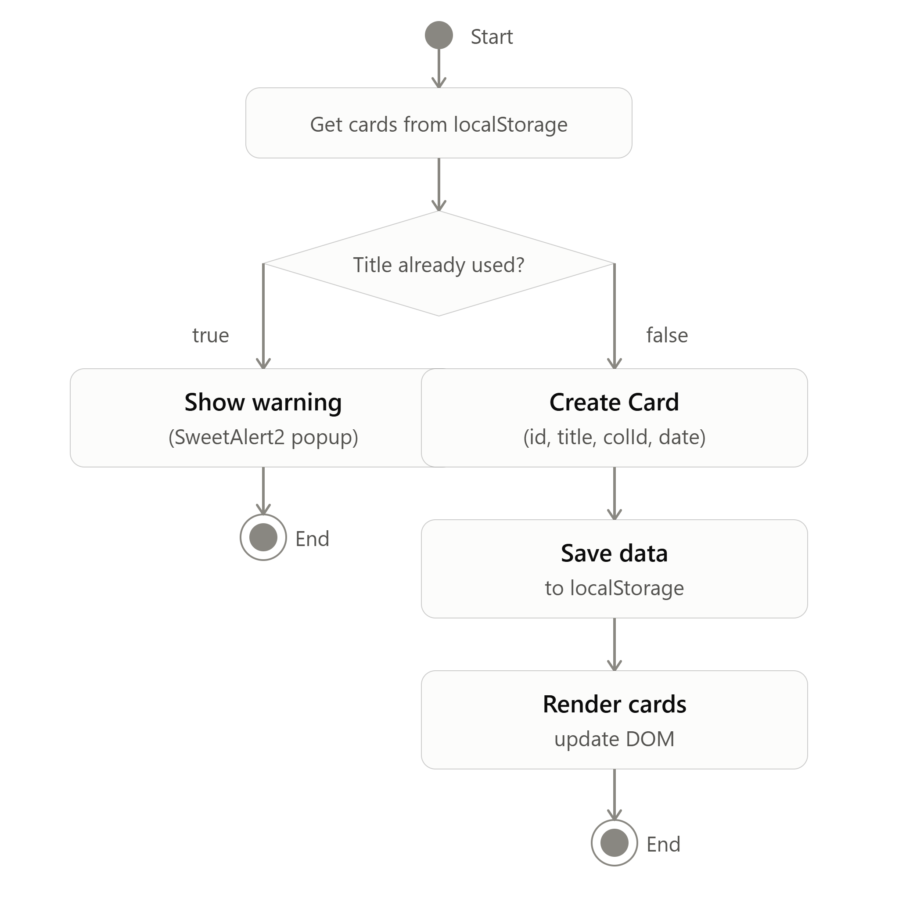
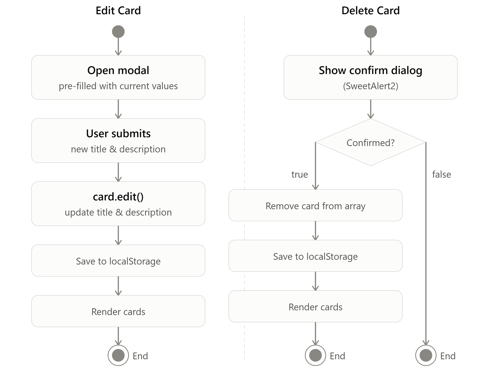
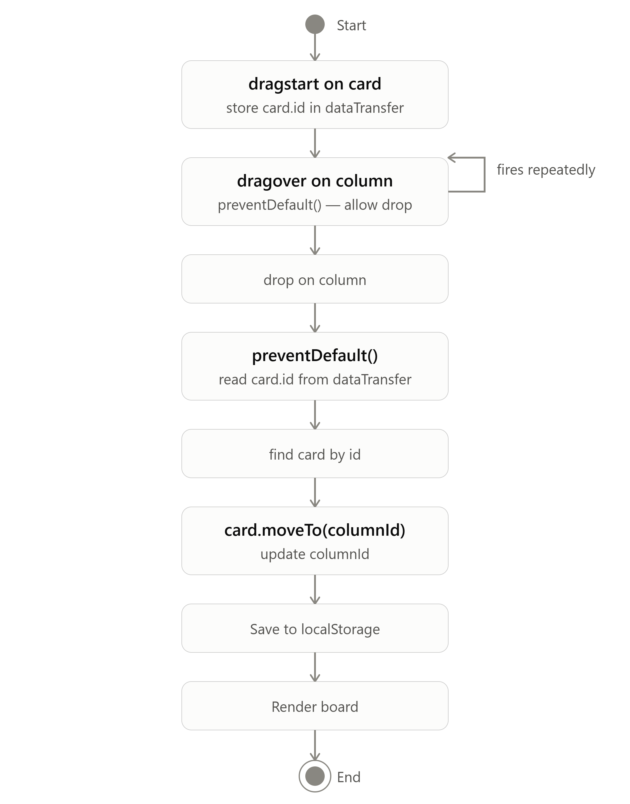
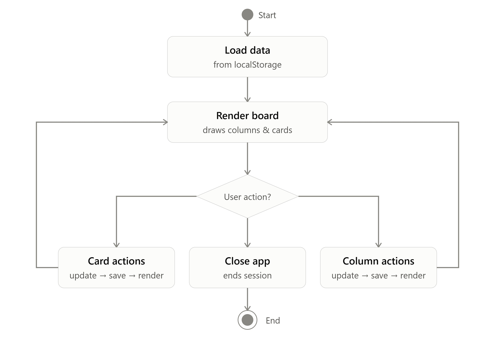

# Kanban Board

A Trello-style task board built with vanilla JavaScript, Tailwind CSS v4, and localStorage. Third project in my frontend portfolio series, following [YesHub](#) (movies/series app) and [Asset Tracker](#) (crypto/fiat portfolio tracker).

## Live Demo

[https://kanban-board-lyart-ten-60.vercel.app/]

## Overview


A board with multiple columns, each with its own color, card count, and cards inside.

## Planning Process

Every project in this series follows the same planning flow before any code is written:

**Wireframe → Class diagram → Activity diagram → (Flowchart, skipped for this project) → README → git init → code → commit per feature**


The flowchart step was intentionally skipped for this project — the activity diagrams covering create/edit/delete for both columns and cards, plus drag-and-drop, were detailed enough on their own to plan the logic without a separate flowchart layer.

### Class diagram



> **Note:** this diagram currently still lists `renderCard()` / `renderColumn()` as class methods. The actual implementation moved rendering out of the classes entirely (see [Architecture](#architecture) below) — the diagram needs a small update in Edraw to drop those two lines and match the final code.

### Activity diagrams

**Create Column / Create Card**

| Create Column | Create Card |
|---|---|
|  |  |

**Edit / Delete Card**



**Drag and Drop**



**App overview**



## Features

### Add a column


Custom name and color, chosen via a color picker. Validates against empty names and duplicate column names before allowing submission.

### Add a card


Title and description. The card's fold-corner accent automatically matches its parent column's color.

### Edit / Move / Delete a card


Each card's "..." menu opens Edit, Move to (lists every other column to move the card into), and Delete. Columns have the same pattern for Edit/Delete.

### Move cards: drag-and-drop (desktop) + tap menu (mobile)

Cards can be dragged directly between columns on desktop using native HTML5 drag-and-drop. Since touch devices don't reliably support native drag events, the "Move to" menu shown above provides the same functionality on mobile — both call the same underlying `card.moveTo(columnId)` method.

### Empty states


Shown when there are no columns yet. A similar "No cards yet" placeholder appears inside any column with zero cards.

### Responsive layout


Columns stack vertically on mobile; on desktop (`md:` breakpoint and up) they switch to a horizontal, snap-scrolling row.

### Persistence

All data is saved to `localStorage` and restored on page load — refreshing or closing the tab doesn't lose any columns or cards.

## Tech Stack

- Vanilla JavaScript (ES6 classes, no framework)
- Tailwind CSS v4 (CSS-first config via `@theme`)
- SweetAlert2 (modals, restyled to match the app's design system)
- Font Awesome (icons)
- localStorage (persistence — no backend)

## Architecture

### Data structure: flat, not nested

Columns and cards are stored as two separate, flat arrays — not nested (cards are not stored inside their parent column):

```js
let columns = []; // Column[] — { id, name, color }
let cards = [];   // Card[]   — { id, title, description, columnId, createdAt }
```

Each card holds a `columnId` referencing its parent column. To get "all cards in a column," the app filters the flat `cards` array by `columnId` at render time, rather than reading a nested array.

**Why flat instead of nested:** a nested structure (`column.cards = []`) creates two sources of truth for the same data once combined with a flat array, and multi-board support (planned as a future React v2 feature, with a `boardId` on each column) is much simpler to add on top of a flat structure than a nested one.

### Classes stay pure data — no DOM, no rendering

`Column` and `Card` are intentionally small. They hold only:
- Their own properties (`id`, `name`, `color` / `title`, `description`, `columnId`, `createdAt`)
- Methods that only ever operate on their own data (`editColumn()`, `editCard()`, `moveTo()`, `getAgeInDays()`)

Rendering logic, save/load logic, and anything that loops over the full `columns`/`cards` collections lives **outside** the classes, as standalone functions in `main.js`. This is a deliberate separation, not an oversight: a method belongs inside the class only if it only ever needs `this`; anything that needs to see the *whole* collection, or touch the DOM, belongs in the orchestration layer instead.

This keeps the data models reusable in contexts with no DOM at all — a backend, a database layer, or a different frontend framework later — since the class files never assume a browser environment.

### Personal build-order rule

Discovered mid-project, after getting stuck trying to write render functions before there was any real data to render:

**Classes → state + save/load (localStorage) → add/mutate functions → test with `console.log` to confirm real data exists → render functions → wire UI event listeners last.**

Building render logic before there's real data to test against makes debugging blind — you can't tell if a bug is in the render code or simply because no data exists yet. Following this order means every step has something concrete to verify before the next one starts.

### localStorage rehydration

`JSON.parse(localStorage.getItem(...))` returns plain objects, not class instances — they lose all their methods (`editCard()`, `getAgeInDays()`, etc.) in the process. On load, saved data is rehydrated into real class instances before use:

```js
let cards = (JSON.parse(localStorage.getItem('cards')) || []).map(
  card => Object.assign(new Card(card.title, card.description, card.columnId), card)
);
```

A fresh instance is created (so it has real methods), then the saved data is copied on top of it with `Object.assign`, preserving the original `id` and values while restoring the methods.

### Event delegation

Column and card menus, "Move to" targets, and drag-and-drop are all wired using **one delegated listener** on `#main-container`, rather than individual listeners on each button. Since `renderColumn()`/`renderCard()` wipe and rebuild `.innerHTML` on every mutation, any listener attached directly to a button would be destroyed on the next render. A listener on the never-destroyed parent container, combined with `e.target.closest(".some-class")` to identify what was actually clicked, avoids re-attaching listeners after every render.

### Dynamic colors and Tailwind's build-time limitation

Column colors are chosen freely by the user via a color picker, so utility classes like `bg-[${column.color}]` don't work — Tailwind only generates classes it can see as literal text at build time, and a template-string color value doesn't exist until the browser runs the JavaScript. Dynamic colors are applied via inline `style` attributes instead, with CSS custom properties used for things like dynamic hover states (`style="--hover-bg: ${column.color}33"`, read by a `:hover` rule in the stylesheet).

## What I'd Do Differently / Lessons Learned

- **Design mobile-first, not desktop-first** — a lesson carried over from Asset Tracker, applied correctly from the start on this project.
- **Data before rendering, always** — the build-order rule above was the single biggest lesson from this project. Getting stuck trying to render before there was real data to render cost real time and was genuinely confusing until the order was named explicitly.
- **Classes should stay narrow in scope** — my instinct from a classical OOP background (C++/C#) was "if it relates to the object, put it in the class." The missing nuance for frontend work: a method belongs in the class only if it operates purely on `this`; anything needing the full collection or the DOM belongs outside.

## Scope (v1)

Intentionally out of scope for this version, planned for a future React rebuild:
- Multi-board support (would add a `boardId` to `Column` and a sidebar for switching boards)
- In-column card reordering (currently, cards can move between columns but aren't manually reorderable within one)

## Running Locally

```bash
git clone [your repo URL]
cd kanban-board
# open index.html with a local server (e.g. Live Server extension)
```

No build step or dependencies required beyond the Tailwind CLI watcher for CSS changes.
